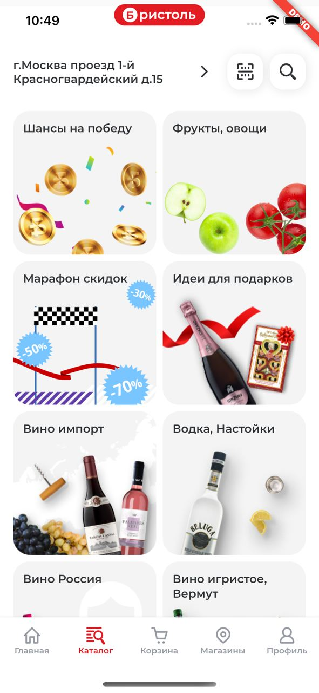

# Pretty iOS notch

Виджет позволяющий добавить под челку нужный контент 

# Размеры в пикселях

|           | longNotch | shortNotch | dynamicIsland |
|-----------|-----------|------------|---------------|
| maxHeight | 26        | 26         | 35            |
| maxWidth  | 150       | 111        | 120           |

PrettyNotch виджет должен помещаться в MaterialApp (builder) либо выше него. Работает за счет Stack

# Примечание

Данный пакета использует информацию из плагина device_info_plus, для определения типа челки 

# Пример 

By @serezhia